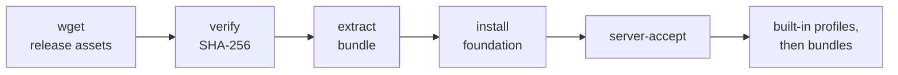

<div align="center">

# server-bootstrap

**One command turns a fresh Ubuntu server, VM, or container into a working development environment.**

Checks the host against its declared specification, installs a pinned toolchain, and starts nothing on its own.

[](https://github.com/evya1/server-bootstrap/actions/workflows/ci.yml)
[](https://github.com/evya1/server-bootstrap/releases/latest)
[](LICENSE)
[](https://ubuntu.com/)
[](https://www.zsh.org/)
[](https://ohmyz.sh/)

</div>

## Install

Paste this whole block into a fresh Ubuntu 24.04 server, VM, or container, as
root. It installs the complete built-in stack: the foundation
[listed below](#what-the-run-installs), including the ngrok CLI, and the
optional `ml` environment.

> [!IMPORTANT]
> No published release ships this block's plan yet. v2.2.3, the latest
> release, has neither `provision-plan.full.example.sh` nor the `ml` profile,
> so today the download fails and the block installs nothing. The block names
> 2.2.3 because that is still this repository's `VERSION`; the release that
> ships the full plan replaces it. Until then, use the
> [foundation-only install](#foundation-only-install), which works with v2.2.3.

```bash
V=2.2.3
BASE=https://github.com/evya1/server-bootstrap/releases/download/v$V
cd /root
wget -q --show-progress \
  "$BASE/server-provision.sh" \
  "$BASE/provision-plan.full.example.sh" \
  "$BASE/server-bootstrap-$V.tar.gz" \
  "$BASE/server-bootstrap-$V.tar.gz.sha256" \
  && sha256sum -c "server-bootstrap-$V.tar.gz.sha256" \
  && chmod +x server-provision.sh \
  && ./server-provision.sh --plan ./provision-plan.full.example.sh
```

That is the whole installation. Each command runs only if the one before it
succeeded, so nothing is installed unless all four files downloaded and the
archive matches its SHA-256. The foundation takes roughly five minutes, most of
it `apt`; the `ml` environment then adds its own download, several gigabytes on
a CUDA host.

- The full plan enables every configurable installer and every built-in
  profile. `ml` uses `--backend auto`: CPU on a host without an NVIDIA GPU,
  CUDA 13.0 on one whose driver supports it. On NVIDIA hardware without such a
  driver the `ml` step stops rather than install CPU; see
  [ML-PROFILE](docs/ML-PROFILE.md).
- The `ml` profile needs 30 GB free for a CUDA backend and 10 GB for CPU,
  checked before it builds. A repeat that rebuilds nothing does not need it.
- It keeps the verified archive. To repeat the install, run the last line
  again; an up-to-date `ml` environment is not rebuilt.

> [!NOTE]
> Fresh hosts and containers often provide a root shell and ship without `sudo`.
> Put `sudo` before `./server-provision.sh` only if you are not root.

### Foundation-only install

`provision-plan.example.sh` installs the foundation alone, without the `ml`
profile, and deletes the archive after a successful run. v2.2.3 publishes it:

```bash
V=2.2.3
BASE=https://github.com/evya1/server-bootstrap/releases/download/v$V
cd /root
wget -q --show-progress \
  "$BASE/server-provision.sh" \
  "$BASE/provision-plan.example.sh" \
  "$BASE/server-bootstrap-$V.tar.gz" \
  "$BASE/server-bootstrap-$V.tar.gz.sha256" \
  && sha256sum -c "server-bootstrap-$V.tar.gz.sha256" \
  && chmod +x server-provision.sh \
  && ./server-provision.sh --plan ./provision-plan.example.sh
```

### After the install

Start the new shell and paste your API keys once, into the one file every
login shell loads:

```bash
exec zsh -l
server-secrets set ANTHROPIC_API_KEY     # prompts, nothing reaches your history
server-secrets set OPENAI_API_KEY
server-secrets set OPENROUTER_API_KEY
server-secrets status                    # masked list of what is set
```

The three coding agents are installed but deliberately **not** authenticated.
With keys in place they are ready; without them, sign in interactively instead:

```bash
claude
codex
pi
```

Nothing else starts on its own: no workload, no model download, no public port.

> [!IMPORTANT]
> While `ANTHROPIC_API_KEY` or `OPENAI_API_KEY` is set, `claude` and `codex`
> bill per token through the API rather than using a Claude Pro/Max or ChatGPT
> subscription. Run `aikeys off` to clear the keys from the current shell and
> get subscription login back, `aikeys on` to reload them.

---

## What the run installs

| Area | Component |
| --- | --- |
| **Shell** | Zsh as login shell, pinned Oh My Zsh, `c` → `clear` and disk/mem/GPU aliases |
| **CLI toolkit** | ~96 apt packages from `config/packages.txt`: `ripgrep`, `fd`, `bat`, `jq`, `fzf`, `zoxide`, `direnv`, `tmux`, `htop`, `zstd`, `sqlite3`, `speedtest-cli`, network and build tooling |
| **Git** | `git`, `git-lfs`, and checksum-verified GitHub CLI 2.101.0 (`gh`) |
| **Tunnels** | Checksum-verified ngrok 3.39.11 agent CLI (`ngrok`), installed only: no auth token, tunnel or service is set up |
| **Node** | Checksum-verified Node.js 24.21.0 LTS, x64 or ARM64 |
| **Agents** | Claude Code 2.1.280, OpenAI Codex 0.156.0 and pi 0.87.1, isolated in `/opt/ai-cli` |
| **API keys** | One root-only `secrets.env` (mode 0600) loaded into every login shell, managed with `server-secrets` |
| **Python** | uv, plus an isolated base environment |
| **Editor** | 49 VS Code extensions for the Remote-SSH host |
| **Hardware** | A `server-accept` report: CPU, RAM, disk speed, and — when a GPU is present — PCIe link width, thermals, ECC |
| **ML** (full plan) | The built-in `ml` profile: one Python 3.12 environment for PyTorch, vision, Jupyter and language tooling, from a frozen lock, plus the `ml-*` commands. No model or dataset |

Every version above is pinned by the release. The two guarantees behind that
word are different and worth separating: **downloaded binary artifacts** —
Node.js, uv, `gh` and ngrok — are verified against SHA-256 values pinned in this
repository before they are extracted, while the **AI CLIs** are exact-version
npm installs whose integrity comes from npm and the registry, not from a
checksum stored here; the bootstrap then verifies that npm installed the version
it asked for. Set any version variable to `latest` to track upstream instead, or
run `tools/refresh-pins.sh --check` to see how far behind the pins have fallen.

## How it works



Acceptance runs **before** any workload. A rejected host stops provisioning, so
you find out the disk is slow or the riser is x1 before any workload depends on
it. A machine with no GPU is accepted normally — set `REQUIRE_ACCELERATOR=1`
when the declared specification requires a GPU.

---

## Which command do I run?

| Goal | Command |
| --- | --- |
| Provision a fresh server with the complete built-in stack (not in v2.2.3) | `./server-provision.sh --plan ./provision-plan.full.example.sh` |
| Provision a fresh server with the foundation only | `./server-provision.sh --plan ./provision-plan.example.sh` |
| Provision a fresh server with the foundation and the ML environment (not in v2.2.3) | `./server-provision.sh --plan ./provision-plan.ml.example.sh` |
| Re-run or repair the foundation on a host that already has it | `server-bootstrap` |
| Install one workload bundle later | `server-bundle-install --name … --version … --source … --sha256 …` |
| Re-check the host against its declared specification | `server-accept` |
| Install or repair the VS Code extension list | `server-vscode-extensions` |
| Paste, inspect or edit your API keys | `server-secrets` |
| Add the optional ML environment to a host that has the foundation | `server-profile install ml` |
| Preview a plan without touching anything | `server-provision --plan … --dry-run` |

> [!WARNING]
> **Never execute a `provision-plan*.sh` file directly.** A plan is a data file,
> not a program: it only calls `register_bootstrap`, `register_bundle`,
> `register_remote_bundle`, and `enable_profile`, which exist for as long as
> `server-provision.sh` is reading it. Always pass it with `--plan`. Running
> one on its own exits with that reminder.

`server-bootstrap.sh` inside the archive is the inner foundation installer.
`server-provision.sh` verifies the archive, unpacks it, runs that script, runs the
acceptance check, and only then installs workload bundles in plan order — which
is why it, not the inner script, is the entry point on a new machine.

## Adding workload bundles

The shipped `provision-plan.example.sh` installs the foundation only, so it runs
green with nothing else downloaded. To add a workload, put its archive and
`.sha256` beside the plan, then uncomment the `register_bundle` block inside it:

```text
server-provision.sh
provision-plan.example.sh
server-bootstrap-2.2.3.tar.gz
server-bootstrap-2.2.3.tar.gz.sha256
<workload>-<version>.tar.gz
<workload>-<version>.tar.gz.sha256
```

Registering a bundle whose archive is not actually present aborts the run *after*
the bootstrap has already installed, so add the files first.

The provisioner installs the bootstrap, runs `server-accept`, installs each
registered bundle in order, and deletes local archives only after success.

## Customizing what gets installed

The distribution packages live in [`config/packages.txt`](config/packages.txt),
not in shell code. `[required]` is installed as one apt batch; `[optional]` is
best effort, for packages whose availability varies across Ubuntu and Debian
releases. Edit the file, or adjust it from the environment without touching it:

```bash
EXTRA_PACKAGES="postgresql-client redis-tools" \
SKIP_PACKAGES="nmap tcpdump" \
  server-bootstrap
```

Each subsystem except ngrok can also be switched off individually —
`INSTALL_GITHUB_CLI=0`, `INSTALL_NODEJS=0`, `INSTALL_VSCODE_EXTENSIONS=0`, and
so on. See [CONFIGURATION](docs/CONFIGURATION.md) for the full list. The full
plan exports every one of them as `1`, and a plan's value wins over the
environment, so to switch one off there, edit its line in the plan.

Tools the bootstrap installs at a pinned version — Node.js, uv, `gh`, ngrok, and
the AI CLIs — are deliberately absent from the manifest. Adding one of them to
it would install a second, unpinned copy.

### Keeping the pinned versions fresh

```bash
tools/refresh-pins.sh            # report drift against upstream
tools/refresh-pins.sh --check --all   # also fail when a branch head has moved
tools/refresh-pins.sh --write    # apply it everywhere the value is recorded
tools/check-pins.sh              # assert those recordings still agree, offline
```

`--check` exits `0` when nothing is actionable, `1` when a pinned **release** is
behind, `2` on a usage error, and `3` when an upstream could not be resolved at
all — which is deliberately not `0`, so a run whose network was broken cannot
read as a clean week. Seven pins track published releases; the Oh My Zsh pin
tracks a branch head that moves several times a day, so its movement is reported
as `MOVED` and does not fail the check unless you ask with `--all`.

`--write` rewrites every file that records a pinned value:
`lib/bootstrap/config.sh`, `config.example.env`, `checksums/*.txt`, `README.md`
and `docs/CONFIGURATION.md`. `CHANGELOG.md` stays a hand edit, because it
records what a bump means. `tools/check-pins.sh` is the offline half: it asserts
that every one of those recordings is present exactly once and equals the
canonical value in `config.sh`, with each architecture anchored to its own
label, so a half-applied bump or a swapped x64/arm64 pair fails in CI.

Tag discovery uses `git ls-remote`, not the GitHub API, so it needs no token and
works from restricted networks.

A weekly workflow (`.github/workflows/pin-drift.yml`) runs the check and keeps
**one** issue open while a release pin is behind, editing it rather than filing a
new one each week. A moved branch head never opens it. A week where an upstream
could not be resolved fails the run instead of reporting a clean result.

---

## Security model

<details>
<summary><b>What the checksum does and does not prove</b></summary>

<br>

The archive checksum is verified before extraction. Fetching an archive and its
`.sha256` from the same origin establishes **integrity, not authenticity**: it
detects a truncated or corrupted transfer, but anyone able to publish to the
release can publish both files. The real trust anchors are HTTPS, account 2FA,
and pinning the expected SHA-256 in your own provision plan.

There is deliberately **no `curl | sh` installer**; it would defeat the verified
archive model the rest of this bundle is built on.

Setting a version variable to `latest` keeps the verification but moves the
expected hash: it comes from the publisher's own checksum manifest, fetched
over HTTPS from the same origin as the artifact. That is the same
integrity-not-authenticity trade as above, made at run time instead of at
release time. Pinned versions remain the default for exactly that reason.

`server-provision.sh` resolves the bootstrap and `register_bundle` entries as
local paths, so the bootstrap archive must be downloaded first. Workload bundles
need not be: `register_remote_bundle` in a plan, or `server-bundle-install`
directly, accepts an `https://` source and enforces TLS plus an exact SHA-256.

</details>

<details>
<summary><b>Guarantees</b></summary>

<br>

- SHA-256 is checked before any downloaded archive is extracted.
- Archives with absolute paths, `..` traversal, or escaping symlinks are rejected.
- Remote sources and the npm registry must use HTTPS.
- Node.js, `gh`, ngrok, Claude Code, Codex, pi, uv, and Oh My Zsh are version-pinned by the release.
- API keys live in one root-owned file at mode 0600, never in `/etc/profile.d`, which is world-readable.
- That file is parsed, not sourced: a backtick or `$(...)` in a pasted value is data, not a command.
- An empty key is not exported, so an untouched placeholder is never mistaken for a credential.
- Package names from the manifest are validated before reaching the apt command line.
- Oh My Zsh is fetched at an exact commit; no upstream installer script is run.
- AI CLI packages go to `/opt/ai-cli`, not the system npm tree.
- Installation state records versions and completion status.
- Local workload archives and checksums are removed only after success.
- No workload, model, dataset, or public service starts automatically.
- The bootstrap never installs or replaces the NVIDIA driver.
- Release archives are byte-reproducible and verified twice on every build.
- Release staging trees and every extracted archive are secret-scanned, and
  `release/dist` is scanned again immediately before upload. It must then hold
  exactly the expected assets, each verified, or nothing is published.
- Security fixes are additive: published history is never rewritten, so the
  complete history stays available to the scanner. See [SECURITY.md](SECURITY.md).

</details>

## Reference

<details>
<summary><b>Commands</b></summary>

<br>

| Command | Purpose |
| --- | --- |
| `server-bootstrap` | Prepare or refresh the general server foundation |
| `server-provision` | Execute a local multi-bundle provisioning plan |
| `server-bundle-install` | Install one verified bundle archive |
| `server-accept` | Check CPU, RAM, disk, and any GPU against the required specification |
| `server-vscode-extensions` | Install or repair the Remote-SSH extension manifest |
| `server-secrets` | Store and inspect the API keys every login shell loads |
| `server-profile` | Install an optional profile built into the release, such as `ml` |

The release also ships `server-provision.sh` as a standalone file, for the first
run before the bootstrap has installed any commands.

`server-bundle-install` is not a second bootstrap step. It is a generic helper for
an explicitly named, versioned, checksum-verified add-on, so running it without
arguments intentionally prints its usage.

</details>

<details>
<summary><b>VS Code Remote-SSH behavior</b></summary>

<br>

VS Code Server normally exists only after the first Remote-SSH connection. If
its CLI is already present, the bootstrap installs the extension manifest
immediately. Otherwise it records a pending result, and the generated Zsh
startup configuration launches a rate-limited background installation when the
first VS Code integrated terminal opens. You can also run it explicitly:

```bash
server-vscode-extensions
```

Reload the Remote-SSH window after a first-time extension installation. Point
`VSCODE_EXTENSIONS_FILE` at your own manifest to install a different list.

</details>

<details>
<summary><b>Interactive shell</b></summary>

<br>

The bootstrap installs Zsh, sets it as root's default login shell, installs a
pinned Oh My Zsh revision, and loads it from `/root/.zshrc`. The generated
server aliases include `c` for `clear`. Reconnect after the first run, or run
`exec zsh -l`, to enter the new login shell immediately.

The same startup configuration loads `/root/.config/server-bootstrap/secrets.env`
and defines `aikeys`:

```bash
aikeys status   # masked list of the keys the file defines
aikeys off      # clear them from this shell, for subscription login
aikeys on       # reload them
```

</details>

<details>
<summary><b>Compatibility</b></summary>

<br>

The old single-add-on environment variables remain supported by
`server-bootstrap.sh`. New multi-bundle setups should use a provision plan.

</details>

## Documentation

| Guide | Covers |
| --- | --- |
| [QUICKSTART](docs/QUICKSTART.md) | First installation and reruns |
| [PROVISIONING](docs/PROVISIONING.md) | Plan format, ordering, deletion, policies |
| [ML-PROFILE](docs/ML-PROFILE.md) | The optional PyTorch, vision, and Jupyter environment |
| [CONFIGURATION](docs/CONFIGURATION.md) | Bootstrap and acceptance variables |
| [ARCHITECTURE](docs/ARCHITECTURE.md) | Modules and responsibility boundaries |
| [BUNDLE-CONTRACT](docs/BUNDLE-CONTRACT.md) | Requirements for future toolkit archives |
| [TROUBLESHOOTING](docs/TROUBLESHOOTING.md) | Failures and recovery |
| [SECURITY](SECURITY.md) | Reporting, credential rotation, no-rewrite policy |
| [SECURITY-SCANNING](docs/SECURITY-SCANNING.md) | Scanner pin and allowlist scope |

## License

[MIT](LICENSE)
