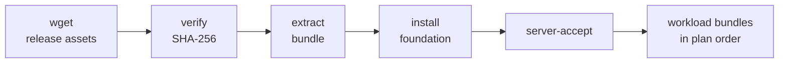

<div align="center">

# server-bootstrap

**One command turns a freshly rented Ubuntu server into a working dev machine.**

Verifies the hardware you paid for, installs a pinned toolchain, and starts nothing on its own.

[](https://github.com/evya1/server-bootstrap/actions/workflows/ci.yml)
[](https://github.com/evya1/server-bootstrap/releases/latest)
[](LICENSE)
[](https://ubuntu.com/)
[](https://www.zsh.org/)
[](https://ohmyz.sh/)

</div>

## Install

Paste this whole block into a freshly rented Ubuntu server, as root:

```bash
V=2.0.1
BASE=https://github.com/evya1/server-bootstrap/releases/download/v$V
cd /root
wget -q --show-progress \
  "$BASE/server-provision.sh" \
  "$BASE/provision-plan.example.sh" \
  "$BASE/server-bootstrap-$V.tar.gz" \
  "$BASE/server-bootstrap-$V.tar.gz.sha256"
chmod +x server-provision.sh
./server-provision.sh --plan ./provision-plan.example.sh
```

That is the whole installation — roughly five minutes, most of it `apt`.

> [!NOTE]
> Rented hosts hand you a root shell and often ship without `sudo`.
> Prefix the last command with `sudo` only if you are not root.

Then start the new shell and sign in to the two coding agents, which are
installed but deliberately **not** authenticated:

```bash
exec zsh -l
claude
codex
```

Nothing else starts on its own: no workload, no model download, no public port.

---

## What the run installs

| Area | Component |
| --- | --- |
| **Shell** | Zsh as login shell, pinned Oh My Zsh, `c` → `clear` and disk/mem/GPU aliases |
| **CLI toolkit** | ~96 apt packages from `config/packages.txt`: `ripgrep`, `fd`, `bat`, `jq`, `fzf`, `zoxide`, `direnv`, `tmux`, `htop`, `zstd`, `sqlite3`, `speedtest-cli`, network and build tooling |
| **Git** | `git`, `git-lfs`, and checksum-verified GitHub CLI 2.96.0 (`gh`) |
| **Node** | Checksum-verified Node.js 24.18.0 LTS, x64 or ARM64 |
| **Agents** | Claude Code 2.1.216 and OpenAI Codex 0.145.0, isolated in `/opt/ai-cli` |
| **Python** | uv, plus an isolated base environment |
| **Editor** | 49 VS Code extensions for the Remote-SSH host |
| **Hardware** | A `server-accept` report: CPU, RAM, disk speed, and — when a GPU is present — PCIe link width, thermals, ECC |

Every version above is pinned by the release and checksum-verified before use.

## How it works



Acceptance runs **before** any workload. A rejected box stops provisioning, so
you find out the disk is slow or the riser is x1 while destroying the instance
is still cheap. A machine with no GPU is accepted normally — set
`REQUIRE_ACCELERATOR=1` when a missing GPU means a failed delivery.

---

## Which command do I run?

| Goal | Command |
| --- | --- |
| Provision a fresh server end to end | `./server-provision.sh --plan ./provision-plan.example.sh` |
| Re-run or repair the foundation on a box that already has it | `server-bootstrap` |
| Install one workload bundle later | `server-bundle-install --name … --version … --source … --sha256 …` |
| Re-check that the rented box matches spec | `server-accept` |
| Install or repair the VS Code extension list | `server-vscode-extensions` |
| Preview a plan without touching anything | `server-provision --plan … --dry-run` |

> [!WARNING]
> **Never execute a `provision-plan*.sh` file directly.** A plan is a data file,
> not a program: it only calls `register_bootstrap` and `register_bundle`, which
> exist for as long as `server-provision.sh` is reading it. Always pass it with
> `--plan`. Running one on its own exits with that reminder.

`server-bootstrap.sh` inside the archive is the inner foundation installer.
`server-provision.sh` verifies the archive, unpacks it, runs that script, runs the
acceptance check, and only then installs workload bundles in plan order — which
is why it, not the inner script, is the entry point on a new machine.

## Adding workload bundles

The shipped `provision-plan.example.sh` installs the foundation only, so it runs
green with nothing else downloaded. To add a workload, put its archive and
`.sha256` beside the plan, then uncomment the `register_bundle` block inside it:

```text
server-provision.sh
provision-plan.example.sh
server-bootstrap-2.0.1.tar.gz
server-bootstrap-2.0.1.tar.gz.sha256
<workload>-<version>.tar.gz
<workload>-<version>.tar.gz.sha256
```

Registering a bundle whose archive is not actually present aborts the run *after*
the bootstrap has already installed, so add the files first.

The provisioner installs the bootstrap, runs `server-accept`, installs each
registered bundle in order, and deletes local archives only after success.

## Customizing what gets installed

The distribution packages live in [`config/packages.txt`](config/packages.txt),
not in shell code. `[required]` is installed as one apt batch; `[optional]` is
best effort, for packages whose availability varies across Ubuntu and Debian
releases. Edit the file, or adjust it from the environment without touching it:

```bash
EXTRA_PACKAGES="postgresql-client redis-tools" \
SKIP_PACKAGES="nmap tcpdump" \
  server-bootstrap
```

Each subsystem can also be switched off individually — `INSTALL_GITHUB_CLI=0`,
`INSTALL_NODEJS=0`, `INSTALL_VSCODE_EXTENSIONS=0`, and so on. See
[CONFIGURATION](docs/CONFIGURATION.md) for the full list.

Tools pinned to a checksummed upstream release — Node.js, uv, `gh`, and the AI
CLIs — are deliberately absent from the manifest. Adding one of them to it would
install a second, unpinned copy.

---

## Security model

<details>
<summary><b>What the checksum does and does not prove</b></summary>

<br>

The archive checksum is verified before extraction. Fetching an archive and its
`.sha256` from the same origin establishes **integrity, not authenticity**: it
detects a truncated or corrupted transfer, but anyone able to publish to the
release can publish both files. The real trust anchors are HTTPS, account 2FA,
and pinning the expected SHA-256 in your own provision plan.

There is deliberately **no `curl | sh` installer**; it would defeat the verified
archive model the rest of this bundle is built on.

`server-provision.sh` resolves plan entries as local paths, so the bootstrap
archive must be downloaded first. Workload bundles do not: `server-bundle-install`
accepts an `https://` source directly and enforces TLS plus an exact SHA-256.

</details>

<details>
<summary><b>Guarantees</b></summary>

<br>

- SHA-256 is checked before any downloaded archive is extracted.
- Archives with absolute paths, `..` traversal, or escaping symlinks are rejected.
- Remote sources and the npm registry must use HTTPS.
- Node.js, `gh`, Claude Code, Codex, uv, and Oh My Zsh are version-pinned by the release.
- Package names from the manifest are validated before reaching the apt command line.
- Oh My Zsh is fetched at an exact commit; no upstream installer script is run.
- AI CLI packages go to `/opt/ai-cli`, not the system npm tree.
- Installation state records versions and completion status.
- Local workload archives and checksums are removed only after success.
- No workload, model, dataset, or public service starts automatically.
- The bootstrap never installs or replaces the NVIDIA driver.
- Release archives are byte-reproducible and verified twice on every build.

</details>

## Reference

<details>
<summary><b>Commands</b></summary>

<br>

| Command | Purpose |
| --- | --- |
| `server-bootstrap` | Prepare or refresh the general server foundation |
| `server-provision` | Execute a local multi-bundle provisioning plan |
| `server-bundle-install` | Install one verified bundle archive |
| `server-accept` | Validate CPU, RAM, disk, and any GPU before you pay for the hour |
| `server-vscode-extensions` | Install or repair the Remote-SSH extension manifest |

The release also ships `server-provision.sh` as a standalone file, for the first
run before the bootstrap has installed any commands.

`server-bundle-install` is not a second bootstrap step. It is a generic helper for
an explicitly named, versioned, checksum-verified add-on, so running it without
arguments intentionally prints its usage.

</details>

<details>
<summary><b>VS Code Remote-SSH behavior</b></summary>

<br>

VS Code Server normally exists only after the first Remote-SSH connection. If
its CLI is already present, the bootstrap installs the extension manifest
immediately. Otherwise it records a pending result, and the generated Zsh
startup configuration launches a rate-limited background installation when the
first VS Code integrated terminal opens. You can also run it explicitly:

```bash
server-vscode-extensions
```

Reload the Remote-SSH window after a first-time extension installation. Point
`VSCODE_EXTENSIONS_FILE` at your own manifest to install a different list.

</details>

<details>
<summary><b>Interactive shell</b></summary>

<br>

The bootstrap installs Zsh, sets it as root's default login shell, installs a
pinned Oh My Zsh revision, and loads it from `/root/.zshrc`. The generated
server aliases include `c` for `clear`. Reconnect after the first run, or run
`exec zsh -l`, to enter the new login shell immediately.

</details>

<details>
<summary><b>Compatibility</b></summary>

<br>

The old single-add-on environment variables remain supported by
`server-bootstrap.sh`. New multi-bundle setups should use a provision plan.

</details>

## Documentation

| Guide | Covers |
| --- | --- |
| [QUICKSTART](docs/QUICKSTART.md) | First installation and reruns |
| [PROVISIONING](docs/PROVISIONING.md) | Plan format, ordering, deletion, policies |
| [CONFIGURATION](docs/CONFIGURATION.md) | Bootstrap and acceptance variables |
| [ARCHITECTURE](docs/ARCHITECTURE.md) | Modules and responsibility boundaries |
| [BUNDLE-CONTRACT](docs/BUNDLE-CONTRACT.md) | Requirements for future toolkit archives |
| [TROUBLESHOOTING](docs/TROUBLESHOOTING.md) | Failures and recovery |

## License

[MIT](LICENSE)
